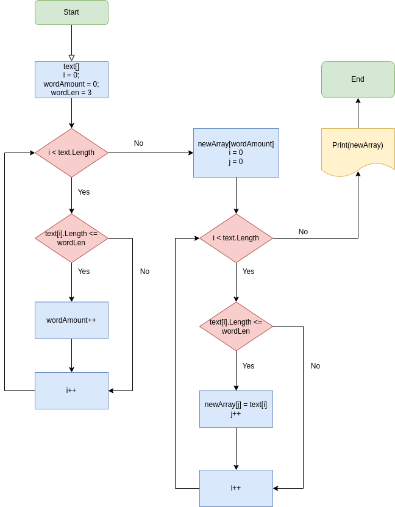

# __FTW__
Final test work based on the results of the first quarter of GB training.
> Task:
>
>   1. Создать репозиторий на GitHub.
>   2. Нарисовать блок-схему алгоритма.
>   3. Снабдить репозиторий оформленным текстовым описанием решения.
>   4. Написать программу, решающую поставленную задачу.
>   5. Использовать контроль версий в работе над этим проектом.

## Content
* [Description](#description)
* [Flowchart](#flowchart)
* [Copyright](#copyright)

## Description
The program filters the specified array of rows by the specified length of rows.
The new array is formed by two cycles implemented in the GetRowsAmount () and
GetSizedStrings () methods. The result of the first method is used by the
second method to create a new array. String arrays are output to the console
using the PrintText () method.

## Flowchart

____________________

## Copyright
 No copyright.

[Go up](#ftw)
